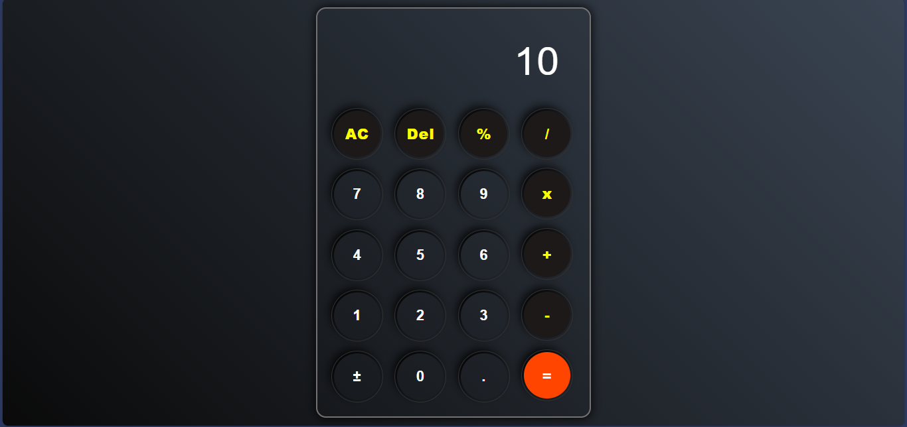

# 🧮 JavaScript Calculator

A simple, responsive web-based calculator built using **HTML**, **CSS**, and **JavaScript**.  
This project performs basic arithmetic operations with a clean and user-friendly interface.

## 🚀 Features

- ➕ Addition  
- ➖ Subtraction  
- ✖ Multiplication  
- ➗ Division  
- 🔄 Clear / Reset function  
- 📱 Responsive design  
- ⚡ Fast and lightweight (No frameworks)

## 🛠 Technologies Used

- **HTML5** – Structure  
- **CSS3** – Styling and layout  
- **JavaScript** – Calculator logic

## 📸 Preview

